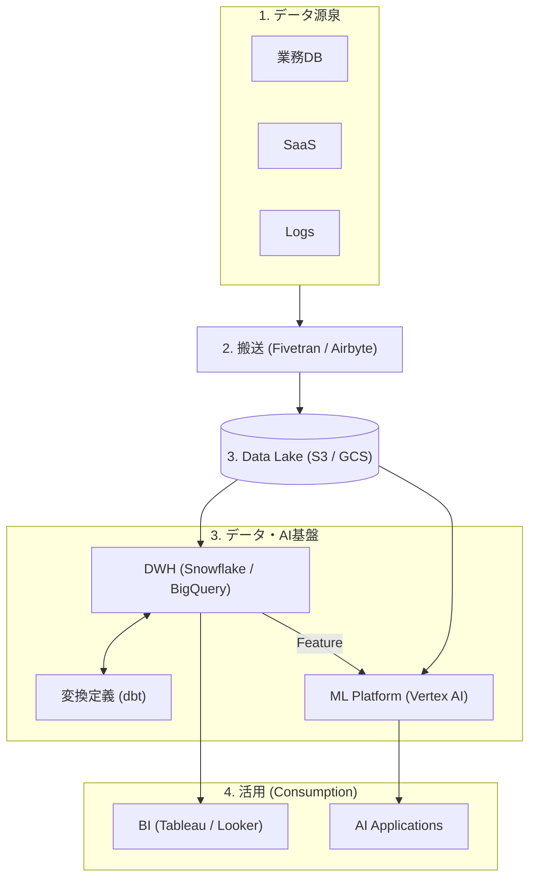

## データ分析の現在(2026?)
Geminiに現在のデータ分析エコシステムにおける「三層構造」と、各ツールの役割、そして「AI Platform」の実態をMermaidの図で整理してもらった

## 免責事項 (Disclaimer)
本図は、モダン・データ・スタックおよびAI基盤の一般的な構成を概念的に整理した一例に過ぎません。以下の点をご理解の上、参照してください。

- 無保証: 本図の内容は、特定のビジネス要件や技術的環境における正当性を保証するものではありません。
- 責任の不保持: 本図の情報を利用、あるいは流用したことにより生じたいかなる不利益・損害（システムトラブル、データ消失、コストの増大等）についても、作成者は一切の責任を負いません。
- 流動性: 掲載されている製品名やアーキテクチャの役割分担は、技術トレンドや各社の製品アップデートにより、予告なく実態と乖離する可能性があります。実際のシステム設計や意思決定にあたっては、必ず最新の公式ドキュメントを確認し、ご自身の責任において検証・判断を行ってください。

