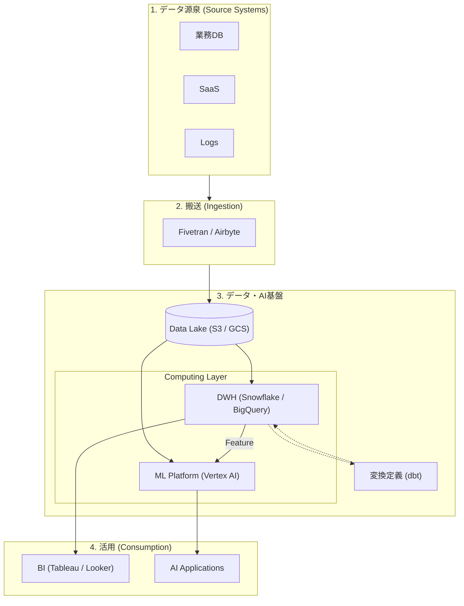

## データ分析の現在(2026?)
Geminiに現在のデータ分析エコシステムにおける「三層構造」と、各ツールの役割、そして「AI Platform」の実態をMermaidの図で整理してもらった

```mermaid
graph TD
    subgraph Sources ["1. データ源泉 (Source Systems)"]
        direction LR
        DB["業務DB"]
        SaaS["SaaS"]
        Logs["Logs"]
    end

    subgraph Ingestion ["2. 搬送 (Ingestion)"]
        ELT["Fivetran / Airbyte"]
    end

    subgraph Platform ["3. データ・AI基盤"]
        Storage[("Data Lake (S3 / GCS)")]
        
        %% ここを横並び(LR)に固定
        subgraph Compute ["Computing Layer"]
            direction LR
            DWH["DWH (Snowflake / BigQuery)"]
            MLP["ML Platform (Vertex AI)"]
        end
        
        Transformation["変換定義 (dbt)"]
    end

    subgraph Consumption ["4. 活用 (Consumption)"]
        direction LR
        BI["BI (Tableau / Looker)"]
        App["AI Applications"]
    end

    %% 接続の順序を整理
    Sources --> Ingestion
    Ingestion --> Storage
    
    %% Storageから二股に分ける（DWHが左、MLPが右）
    Storage --> DWH
    Storage --> MLP
    
    %% dbtはDWHにのみ紐付け
    DWH -.-> Transformation
    Transformation -.-> DWH
    
    %% DWH(左)からMLP(右)へ、BI(左下)とApp(右下)へ素直に流す
    DWH --"Feature"--> MLP
    DWH --> BI
    MLP --> App

```
